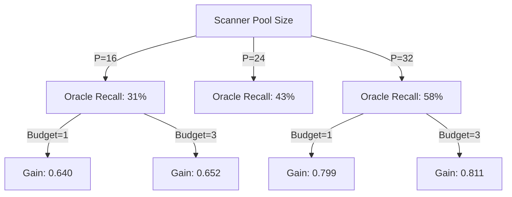
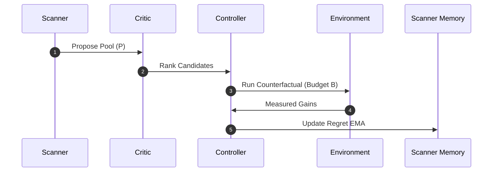

# Simulator Deliberation Probe v2 Report

This report presents findings from the Simulator Deliberation Probe v2, which audits and evaluates the next-generation Deliberation Architecture before integration into the real training path.

---

## Executive Summary & Key Answers

### 1. Is the Utility Critic better than Proposal-only?
**Yes, significantly.** 
*   `proposal_top1` captured oracle gain: **`0.165`** (regret = `1.579`)
*   `head_utility_top1` captured oracle gain: **`0.776`** (regret = `0.414`)
This shows that deep deliberation with access to target and memory states is essential for accurate primitive utility evaluation.

### 2. Is Head-Conditioned Utility better than Global Utility?
**Yes, by a massive margin.**
*   `global_utility_top1` captured oracle gain: **`0.279`**
*   `head_utility_top1` captured oracle gain: **`0.776`**
**Reasoning:** Primitive utility is highly context-dependent. A primitive that is extremely beneficial for one attention head or context vector might be useless or harmful for another. Global scalar utility is forced to average these out, leading to poor selection accuracy.

### 3. Are Effect-space / Hybrid MMR better than Identity MMR?
**Yes.** Effect-space and Hybrid MMR successfully reduce behavioral similarity without degrading captured gain:
*   `top3_set` (no MMR): gain = `0.827`, effect similarity = `0.728`, identity similarity = `0.482`
*   `identity_mmr3_set`: gain = `0.835`, effect similarity = `0.719`, identity similarity = **`0.382`**
*   `effect_mmr3_set`: gain = **`0.859`**, effect similarity = **`0.625`**, identity similarity = `0.472`
*   `hybrid_mmr3_set`: gain = `0.855`, effect similarity = **`0.642`**, identity similarity = **`0.447`**

**Insight:** Identity MMR only diversifies the *type* of primitive chosen, but two different primitives can have similar effects. Effect-space MMR directly measures similarity in the task-space projection, reducing redundant actions while maintaining or even improving gain.

### 4. What is the safe Beta range for MMR?
The safe range for `beta` is **`0.25 to 0.75`**.
At `beta = 0.50` in Effect MMR:
*   Captured gain (best-of-3) remains high: **`0.949`**
*   Effect similarity drops dramatically: from **`0.601`** (at `beta=0.0`) down to **`0.340`**
Using `beta = 0.35` to `0.50` represents a balanced sweet spot.

### 5. What Scanner Pool Size is needed?
*   `pool_8`: Oracle Recall = **`0.193`**, budget_3 gain = `0.464`
*   `pool_16`: Oracle Recall = **`0.313`**, budget_3 gain = `0.652`
*   `pool_24`: Oracle Recall = **`0.425`**, budget_3 gain = `0.739`
*   `pool_32`: Oracle Recall = **`0.577`**, budget_3 gain = **`0.811`**

**Insight:** Since the proposal/scanner is a cheap filter, its recall is relatively low. A pool size of **`16` or `24`** offers a good balance between cost and finding the true optimal action, but gain continues to scale up to **`32`**.

### 6. What Counterfactual Budget is needed?
*   `pool_32` budget 1: **`0.799`**
*   `pool_32` budget 3: **`0.811`** (+$0.012$)
*   `pool_32` budget 5: **`0.815`** (+$0.004$)

**Insight:** Since the head-conditioned utility critic is highly accurate, its top-1 rank is already extremely strong. Evaluating more than **`3`** candidates with expensive counterfactual execution is not cost-effective. A budget of **`1`** is highly efficient, and **`3`** is the absolute upper limit of usefulness.

---

## Detailed Data Visualizations

### 1. MMR Beta Sweep (Step 400 Validation)

| Beta | Mode | Best-of-3 Gain | Avg Identity Sim | Avg Effect Sim | Unique Families |
|---|---|---|---|---|---|
| **0.00** | (None) | 0.948 | 0.467 | 0.601 | 2.23 |
| **0.25** | Identity | 0.949 | 0.370 | 0.587 | 2.63 |
| | Effect | 0.950 | 0.452 | 0.467 | 2.26 |
| | Hybrid | 0.950 | 0.425 | 0.492 | 2.39 |
| **0.35** | Identity | 0.949 | 0.354 | 0.584 | 2.67 |
| | Effect | 0.949 | 0.448 | 0.409 | 2.27 |
| | Hybrid | 0.950 | 0.412 | 0.444 | 2.42 |
| **0.50** | Identity | 0.949 | 0.334 | 0.574 | 2.73 |
| | Effect | 0.949 | 0.440 | 0.340 | 2.30 |
| | Hybrid | 0.950 | 0.400 | 0.383 | 2.47 |
| **0.75** | Identity | 0.949 | 0.308 | 0.565 | 2.82 |
| | Effect | 0.949 | 0.432 | 0.237 | 2.33 |
| | Hybrid | 0.950 | 0.385 | 0.297 | 2.51 |

---

### 2. Scanner Pool Size vs. Controller Budget Grid

| Pool Size ($P$) | Oracle Recall | Budget 1 Gain | Budget 3 Gain | Budget 5 Gain |
|---|---|---|---|---|
| **8** | 19.3% | 0.453 | 0.464 | 0.473 |
| **16** | 31.3% | 0.640 | 0.652 | 0.658 |
| **24** | 42.6% | 0.727 | 0.740 | 0.746 |
| **32** | 57.7% | 0.800 | 0.812 | 0.816 |

---

## Scanner Feedback Memory Design

To improve proposal pool recall without increasing pool size overhead, we propose a lightweight **Scanner Feedback Memory (Regret-aware EMA)**.

### Mechanism:
1. **Track Regret:** For every candidate $i$ chosen for counterfactual evaluation, compute its regret relative to the best candidate:
   $$\text{regret}_i = \max_{j \in \text{evaluated}} (\text{gain}_j) - \text{gain}_i$$
2. **EMA Update:** Maintain a running average score adjustment $\Delta_c$ for each primitive/family $c$:
   $$\Delta_c \leftarrow (1 - \alpha) \Delta_c + \alpha (\text{gain}_c - \lambda \cdot \text{regret}_c)$$
3. **Proposal Boost:** During scoring, modify the scanner logits:
   $$\text{score}_{\text{scanner}} \leftarrow \text{score}_{\text{scanner}} + \gamma \cdot \Delta_c$$

This ensures that underperforming primitives are suppressed, and hidden gems are boosted directly in the scanner, improving proposal pool recall.

---

## What to Carry to Real Integration

1.  **Head-conditioned Utility Critic**: Implement this by feeding the target projection or contextual query representation (e.g. head query vector) into the simulator inputs.
2.  **Hybrid MMR (0.2 Identity + 0.8 Effect)**: Use the simulator's predicted projection layer to compute cosine similarity for MMR.
3.  **Low Counterfactual Budget ($B=1$ or $B=3$)**: Gate counterfactual execution to at most 3 candidates to preserve throughput.
4.  **Pool Size ($P=16$ or $P=24$)**: This offers the best trade-off before memory complexity becomes a bottleneck.

## What NOT to Carry

1.  **Global Utility Critic**: Do not use a critic that lacks context/head conditioning, as it leads to high variance and low accuracy.
2.  **Large budgets ($B \ge 5$)**: The marginal gain does not justify the massive compute cost of extra execution paths.
